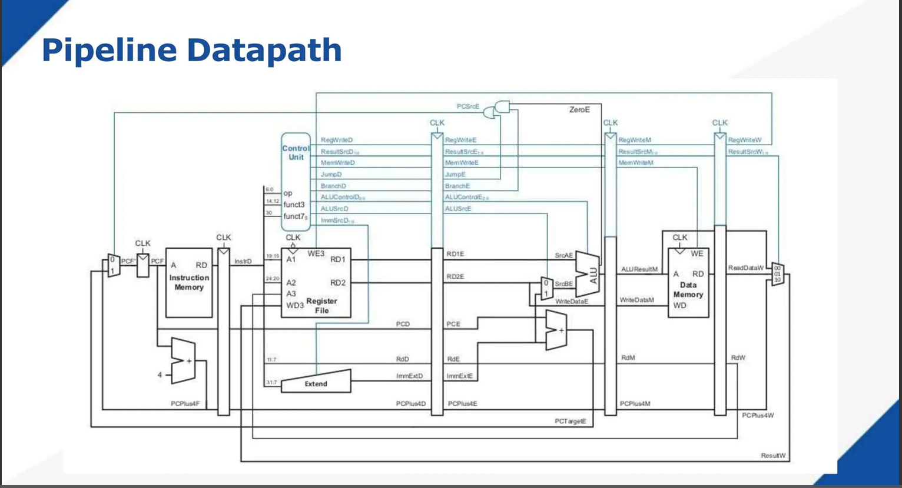
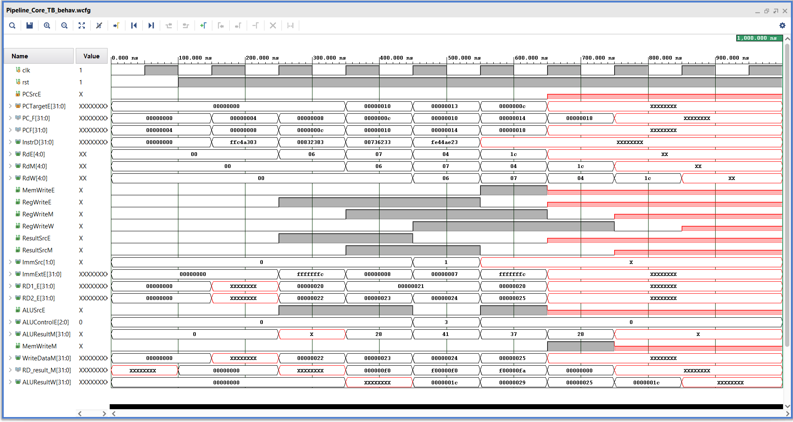
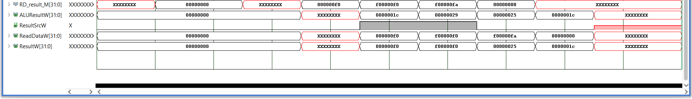

# RISC-V

This project is an implementation of a pipelined RISC-V single-core processor, designed to improve instruction throughput over a basic single-cycle architecture.

It includes:

A five-stage pipelined architecture consisting of the stages:

**IF**: Instruction Fetch

**ID**: Instruction Decode / Register Fetch

**EX**: Execute / ALU Operations

**MEM**: Memory Access

**WB**: Write Back

# 📂 Architecture Diagrams
Pipelined Architecture (Implemented and modified based on the single-cycle design)

Pipeline registers: IF/ID, ID/EX, EX/MEM, MEM/WB

## 📊 Simulation Results

The waveform below shows the output waveform of the some instruction implemented on the risc-v processor:

Instructuctions: 

**FFC4A303**: LW X6, -4(X9);

**00832383**: LW X7, 8(X6);

**00736233**: OR X4, X6, X7;

**FE44AE23**: SW X4, -4(X9);

