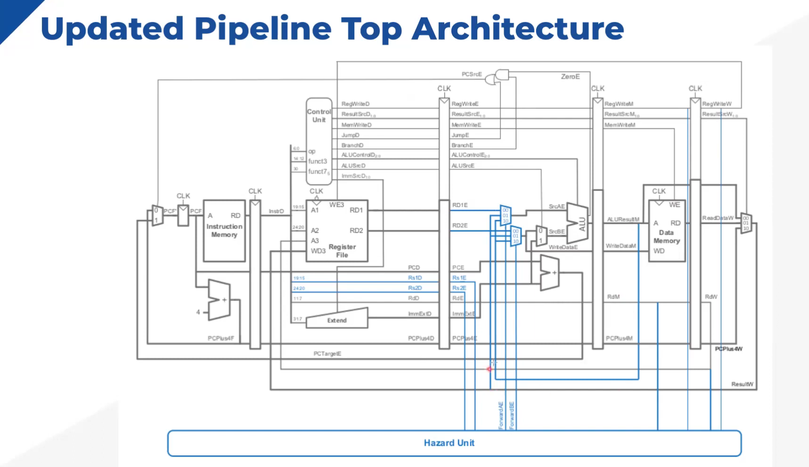
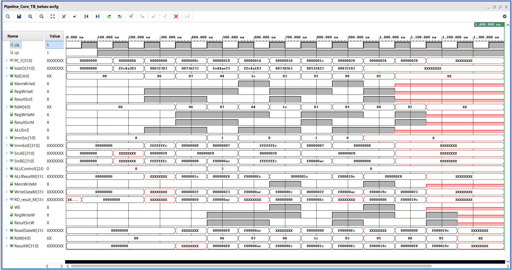

# RISC-V

This project is an implementation of a pipelined RISC-V single-core processor, designed to improve instruction throughput over a basic single-cycle architecture.

It includes:

A five-stage pipelined architecture consisting of the stages:

**IF**: Instruction Fetch

**ID**: Instruction Decode / Register Fetch

**EX**: Execute / ALU Operations

**MEM**: Memory Access

**WB**: Write Back

# Architecture Diagrams

Pipelined Architecture (Implemented and modified based on the single-cycle design)

Pipeline registers: IF/ID, ID/EX, EX/MEM, MEM/WB

Hazard mitigation through signal forwarding and control signal propagation.

## 📊 Simulation Results

The waveform below shows the output waveform of the some instruction implemented on the risc-v processor:

Instructuctions: 

FFC4A303 → LW X6, -4(X9)

00832383 → LW X7, 8(X6)

00736233 → OR X4,X6,X7

FE44AE23 → SW X4, -4(X9)

FFC4A183 → LW X3,-4(X9)

007302B3 → ADD X5,X6,X7

00532423 → SW X5, 8(X6)

00832103 → LW X2, 8(X6)

